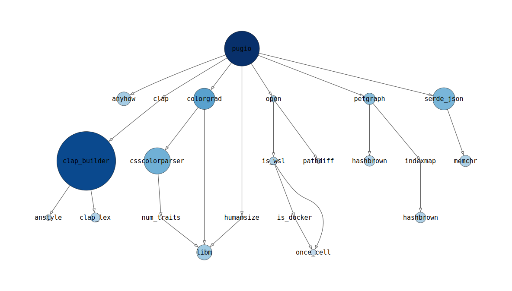
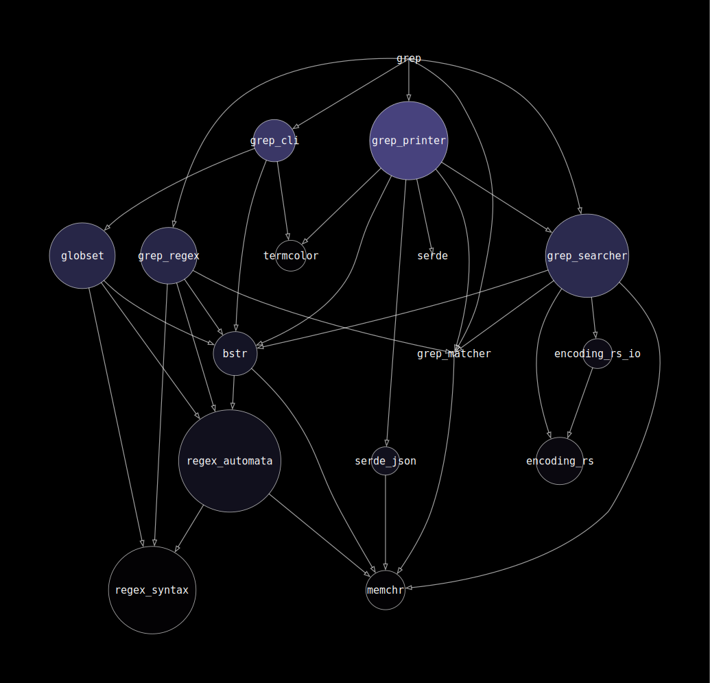
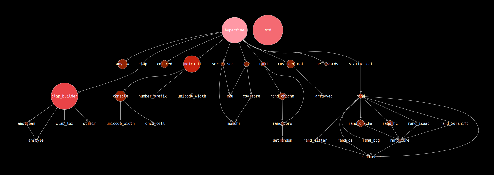

# Pugio

*Pugio* is a graph visualisation tool for Rust to estimate and present the binary size contributions of a crate and its dependencies. It uses `cargo-tree` and `cargo-bloat` to build the dependency graph where the diameter of each crate node is logarithmic to its size. The resulting graph can then be either exported with `graphviz` and opened as an SVG file, or as a DOT graph file for additional processing.

It is important to note that the sizes is and will always be only an *estimation*. Some information is irrevocably lost during compilation and linkage. In addition, calls to the standard library is not included in the caller's size (although the total size of the standard library can be shown with the `--std` flag). Multiple versions of a dependency is also not distinguishable in the final binary.

## Example

`pugio --release --gradient blues -t 1024 -o pugio.svg`



`pugio --bin rg --release --scheme dep-count --gradient purples -t 4096 --gamma 0.5 --dark-mode -o ripgrep.svg`



`pugio --release --gradient reds -t 1 --dark-mode --std -o hyperfine.svg`



## Dependencies

- `cargo`: `cargo-tree` command is now part of the cargo binary
- [`cargo-bloat`](https://crates.io/crates/cargo-bloat)
- [`dot`](https://graphviz.org/): part of the `graphviz` package; optional, needed for SVG image generation (disabled via the `--dot-only` option)

## Planned Features

- Filter options
- Edge label by dependency features
- Additional style customisation
- Interactive SVG support (function breakdown)

## Usage

```plain
A command-line dependency binary size graph visualisation tool

Usage: pugio [OPTIONS]

Options:
  -p, --package <PACKAGE>      Package to inspect
      --bin <BINARY>           Binary to inspect
  -F, --features <FEATURES>    Space or comma separated list of features to activate
      --all-features           Activate all available features
      --no-default-features    Do not activate the `default` feature
      --release                Build artifacts in release mode, with optimizations
      --std                    Add std standalone node
  -s, --scheme <SCHEME>        Color scheme of nodes
                                - "cum-sum": cumulative sum of the size of a node and its dependencies
                                - "dep-count": dependency count; number of transitive dependency relations from a node
                                - "rev-dep-count": reverse dependency count; number of paths from the root to a node
  -g, --gradient <GRADIENT>    Color gradient of nodes
                                - "reds", "oranges", "purples", "greens", "blues"
                                - custom CSS gradient format, e.g. "#fff, 75%, #00f"
      --gamma <GAMMA>          Color gamma of nodes, between 0.0 and 1.0
  -t, --threshold <THRESHOLD>  Remove nodes that have cumulative sum below threshold
      --inverse-gradient       Inverse color gradient
      --dark-mode              Dark mode for output svg file
      --dot-only               Dot output file only
  -o, --output <OUTPUT>        Output filename, default is output.*
      --no-open                Do not open output svg file
  -h, --help                   Print help
  -V, --version                Print version
```

## License

Pugio is licensed under the BSD+Patent license, see [LICENSE](LICENSE) for more details.

*Note: This license is designed to provide: a) a simple permissive license; b) that is compatible with the GNU General Public License (GPL), version 2; and c) which also has an express patent grant included.*
